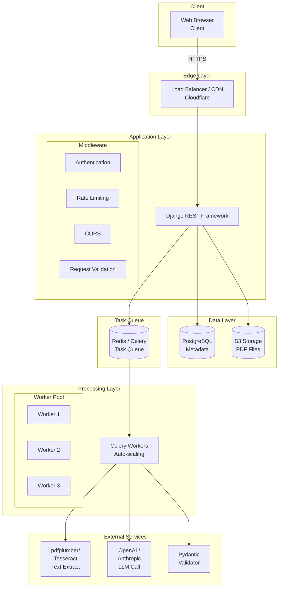
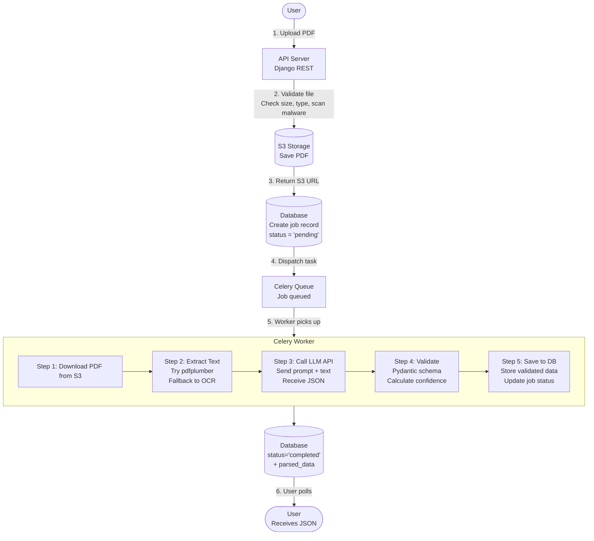
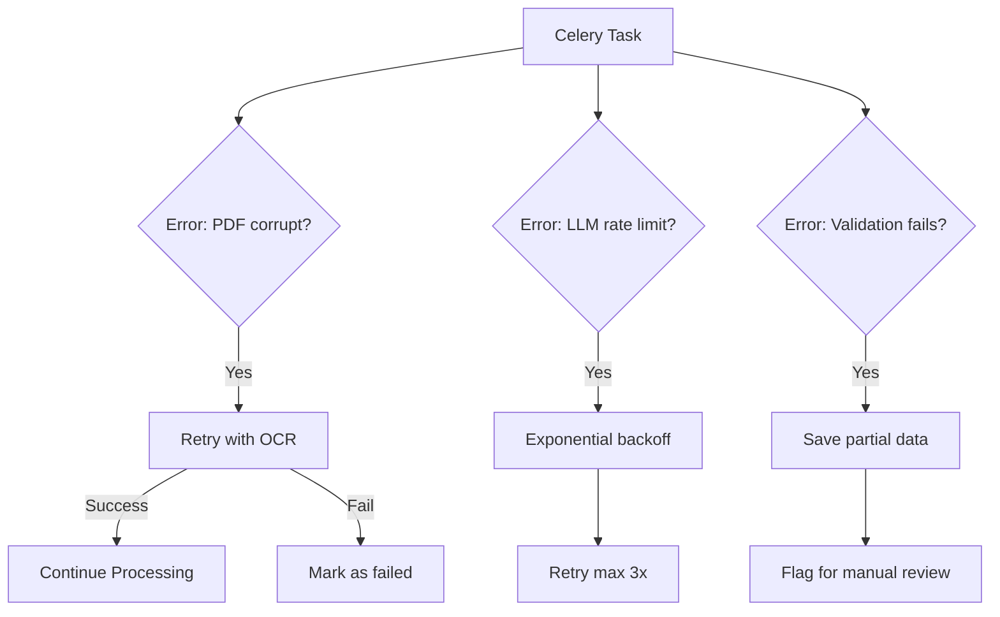
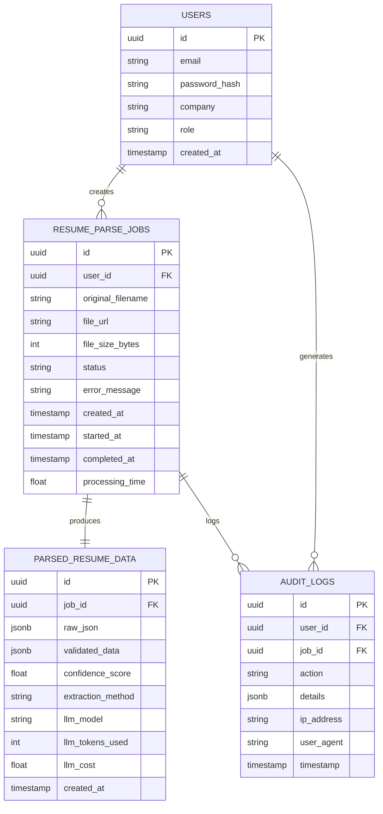
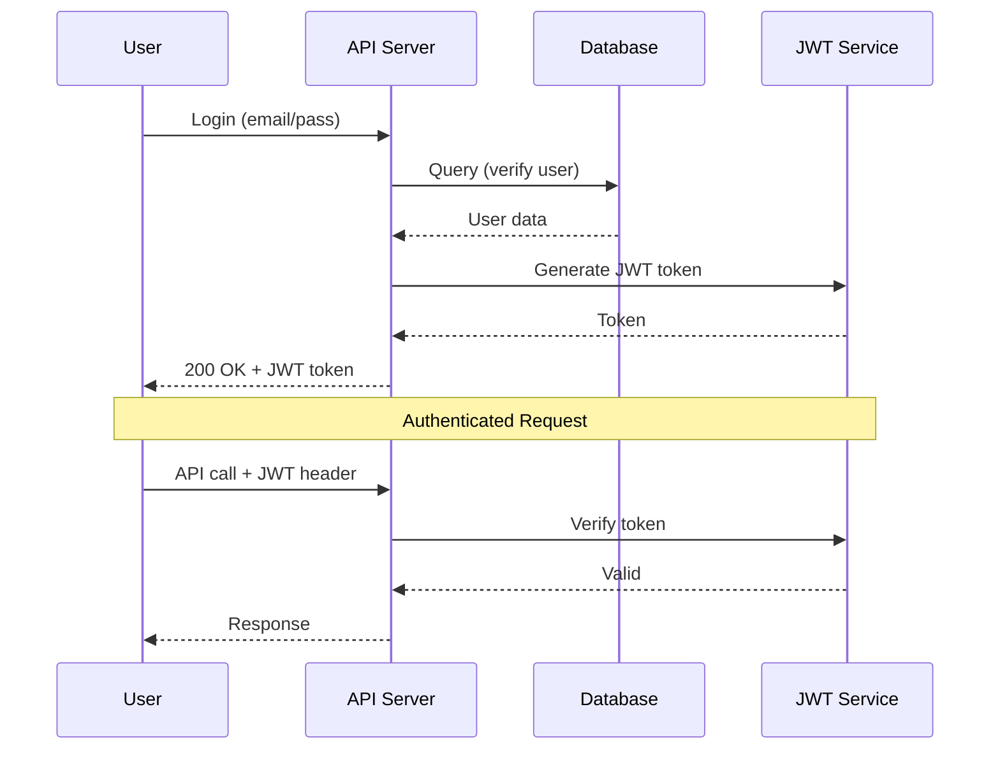
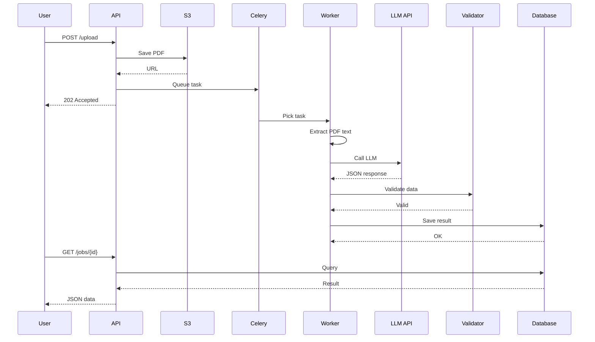
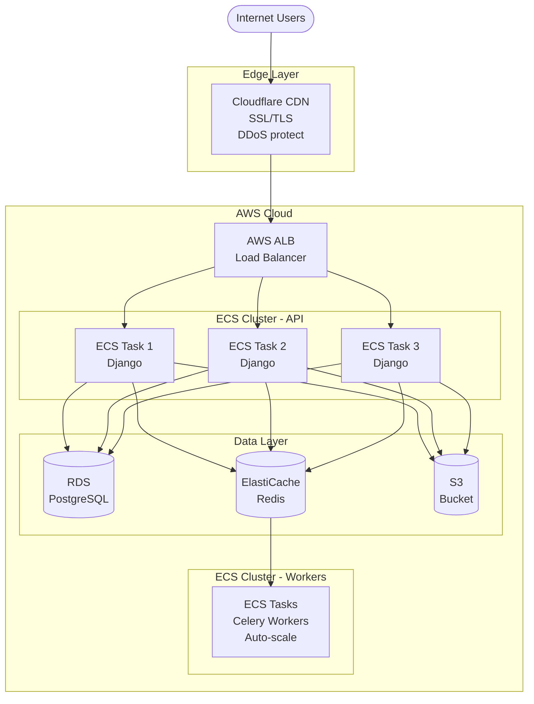
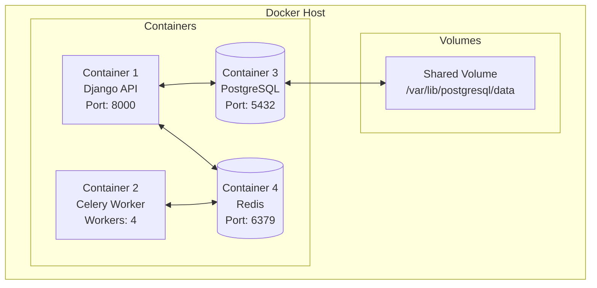
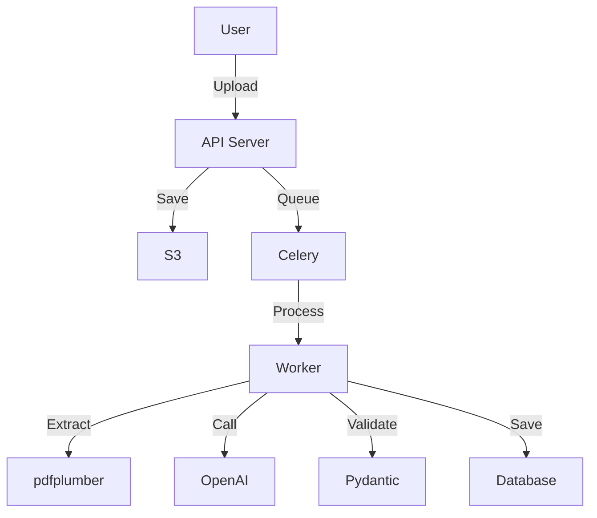
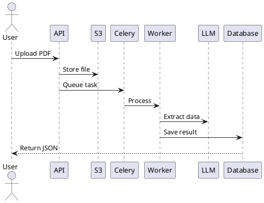

# Resume Parser - Architecture Diagrams Guide

This document provides visual representations of the system architecture and guidance on creating diagrams for presentations or documentation.

---

## Table of Contents
1. [System Architecture Diagram](#system-architecture-diagram)
2. [Data Flow Diagram](#data-flow-diagram)
3. [Database Schema](#database-schema)
4. [Sequence Diagrams](#sequence-diagrams)
5. [Deployment Architecture](#deployment-architecture)
6. [Creating Diagrams](#creating-diagrams)

---

## System Architecture Diagram

### High-Level Architecture

This shows the complete system from client to data storage:



### Component Responsibilities

| Component | Responsibility | Technology |
|-----------|---------------|------------|
| **Client** | UI, file upload, display results | React, TanStack Table |
| **Load Balancer** | Traffic distribution, SSL, DDoS | Cloudflare, AWS ALB |
| **API Server** | Request handling, auth, validation | Django REST Framework |
| **Task Queue** | Async job processing | Celery + Redis |
| **Workers** | PDF parsing, LLM calls | Python, OpenAI |
| **Database** | Store metadata, parsed data | PostgreSQL |
| **File Storage** | Store PDFs, exports | AWS S3, Cloudflare R2 |

---

## Data Flow Diagram

### Single Resume Upload Flow



### Error Flow



---

## Database Schema

### Entity Relationship Diagram



### Key Indexes

```sql
-- Resume parse jobs
CREATE INDEX idx_jobs_user_status ON resume_parse_jobs (user_id, status);
CREATE INDEX idx_jobs_created ON resume_parse_jobs (created_at DESC);

-- Parsed data (JSONB queries)
CREATE INDEX idx_parsed_name ON parsed_resume_data ((validated_data->'contact'->>'name'));
CREATE INDEX idx_parsed_email ON parsed_resume_data ((validated_data->'contact'->>'email'));
CREATE INDEX idx_parsed_skills ON parsed_resume_data USING GIN ((validated_data->'skills'->'technical'));
```

---

## Sequence Diagrams

### Authentication Flow



### Resume Parsing Sequence



---

## Deployment Architecture

### Production Infrastructure (AWS)



### Docker Container Architecture



---

## Creating Diagrams

### Tools for Creating Diagrams

#### 1. **Mermaid.js** (Recommended for documentation)



**Usage**: Embed in Markdown, render in GitHub/GitLab

#### 2. **draw.io / diagrams.net** (For presentations)

- Free, web-based
- Export to PNG, SVG, PDF
- Templates available
- URL: https://app.diagrams.net/

#### 3. **Lucidchart** (Professional diagrams)

- Collaborative editing
- Cloud-based
- Extensive shape libraries
- URL: https://www.lucidchart.com/

#### 4. **PlantUML** (Code-based diagrams)



#### 5. **Excalidraw** (Hand-drawn style)

- Simple, fast
- Export to PNG/SVG
- URL: https://excalidraw.com/

### Diagram Best Practices

1. **Keep it simple**: One concept per diagram
2. **Use consistent shapes**: Rectangles for services, cylinders for databases
3. **Show data flow**: Use arrows with labels
4. **Include legends**: Explain colors/shapes
5. **Version control**: Store diagram source files in Git

### Recommended Diagram Types

| Purpose | Diagram Type | Tool |
|---------|-------------|------|
| System overview | Component diagram | draw.io |
| Request flow | Sequence diagram | PlantUML |
| Database design | ER diagram | dbdiagram.io |
| Deployment | Infrastructure diagram | AWS Architecture |
| Data processing | Flowchart | Mermaid |

---

## Interactive Diagrams

### Using Mermaid in GitHub

Create `.md` files with mermaid code blocks:

\`\`\`mermaid
sequenceDiagram
    User->>API: POST /upload
    API->>S3: Save PDF
    API->>Celery: Queue task
    Celery->>Worker: Process
    Worker->>LLM: Extract
    Worker->>DB: Save
    DB-->>User: JSON
\`\`\`

GitHub will render these automatically!

---

## Diagram Templates

All diagram templates are available in the `docs/diagrams/` directory:

- `system-architecture.drawio` - Main system diagram
- `data-flow.drawio` - Data flow diagram
- `database-schema.dbml` - Database schema (dbdiagram format)
- `deployment.drawio` - AWS deployment diagram
- `sequence-auth.puml` - Authentication sequence (PlantUML)

---

## Further Resources

- **AWS Architecture Icons**: https://aws.amazon.com/architecture/icons/
- **C4 Model**: https://c4model.com/ (Structured architecture diagrams)
- **UML Diagrams**: https://www.uml-diagrams.org/
- **System Design Primer**: https://github.com/donnemartin/system-design-primer

---

**Last Updated**: 2026-02-05
